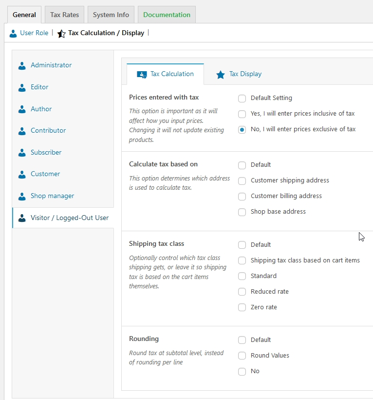

# Tax Calculation

## Configuring Tax Options

To start configuring taxes:

Go to: **WooCommerce &gt; Settings &gt; Tax**. This tab is only visible if taxes are enabled.

The **Tax** tab displays several options that can be set to suit your needs — settings you choose are based on the tax jurisdiction under which your store is located.

Once you have configured all the tax in WooCommerce. go to **Role Based Tax** Settings page and set tax Calculation based on user roles.

## Options

### Price Entered With Tax ?



### Calculate Tax Based On



### Shipping Tax Class



### Rounding

 If you enable **Rounding tax at subtotal level, instead of per line**, the rounding is done at the **Subtotal** level. Check your tax jurisdiction to know if this is done.

