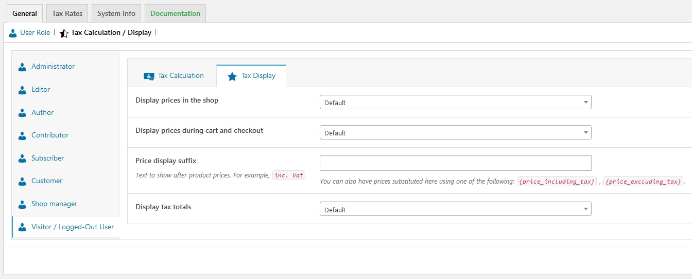

# Tax Display

### Display Prices in the Shop

This option determines how prices are displayed in your shop/catalog. Choose from inclusive/exclusive tax display.

### Display Prices During Cart and Checkout

This option determines how prices are displayed in your cart and checkout pages – it works independently of your catalog prices. Choose from inclusive/exclusive tax display.


**Note:** The address field needs to be filled in to get tax calculations if you have a tax table that distinguishes between locations


### Price Display Suffix

Allows you to change display to: “Prices include \_\_% tax/VAT” or anything appropriate for your store. You can use these two placeholders if you want to have text before _and_ after the price:

* `{price_including_tax}`
* `{price_excluding_tax}`

For example: “Price incl. VAT: `{price_including_tax}`” will display as: “Price incl. VAT: $15” \(if that is the price, of course\). So, if you’ve set the taxes to display excluding tax, you could add in small print what the tax inclusive of tax will look like:

### Display Tax Totals

This determines if multiple taxes get displayed as one total during checkout, or as an itemized list of taxes.

